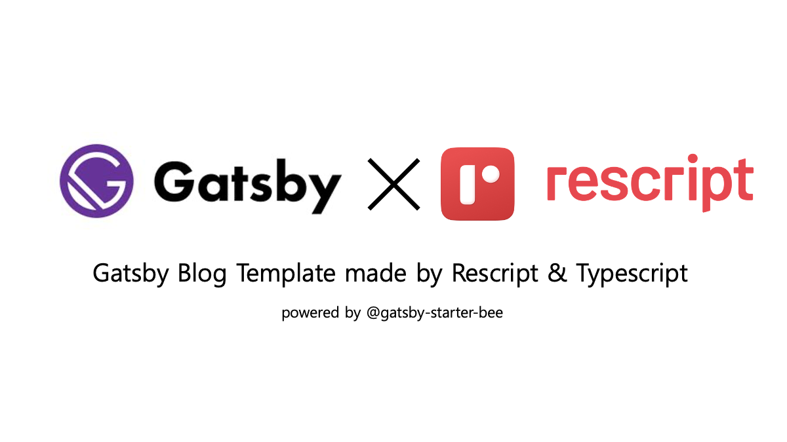

# Gatsby Starter Blog Rescript 🍭

<h2 align="center">
  
  <br>
</h2>

## 🚀 Quick start

1.  **Create a Gatsby site.**

    ```shell
    # create a new Gatsby site using the default starter
    npx gatsby new <project-name> https://github.com/alstn2468/gatsby-starter-blog-rescript
    ```

2.  **Setting environment variables.**

    Copy the file `.env.example` and modify it according to your settings.

    ```env
    PUBLIC_URL="https://<GITHUB_ID>.github.io/<REPOSITORY_NAME>/"
    ```

3.  **Start developing.**

    ```shell
    cd <project-name>/
    yarn dev
    ```

4.  **Open the source code and start editing!**

    Your site is now running at `http://localhost:8000`!

    _Note: You'll also see a second link: _`http://localhost:8000/___graphql`_. This is a tool you can use to experiment with querying your data. Learn more about using this tool in the [Gatsby tutorial](https://www.gatsbyjs.com/tutorial/part-five/#introducing-graphiql)._

## ✏️ Customize

### ⚙ Gatsby config

_Learn more about Gatsby Node API in the [Gatsby document](https://www.gatsbyjs.com/docs/reference/config-files/gatsby-node)._

```
/root
└── /gatsby
    ├── gatsby-config.ts
    ├── gatsby-meta-config.ts → ⭐️⭐️ Fix meta data of blog ⭐️⭐️
    └── gatsby-node.ts
        ├── types.ts
        ├── createPages.ts
        ├── onCreateNode.ts
        └── createSchemaCustomization.ts
```

### 🏗 Structure

_WIP_

### 🎨 Style

_WIP_

### 🍭 Tips (You can change...)

- Profile image! (replace file in `/content/assets/profile.png`)
- Favicon image! (replace file in `/content/assets/icon.png`)
- Utterances repository! (replace repository address in `/gatsby/gatsby-meta-config.ts`)
  - ⚠️ Please check, this guide(<https://utteranc.es/>)

## 🚧 ISSUE

1. **graphql-ppx didn't support gatsby3** → [gatsby(#25406)](https://github.com/gatsbyjs/gatsby/issues/25406), [graphql-ppx(#165)](https://github.com/reasonml-community/graphql-ppx/issues/165)

## 🔍  REFERENCE

- [gatsby-starter-bee@jbee](https://github.com/JaeYeopHan/gatsby-starter-bee)

## :bug: Bug reporting

[Issue](https://github.com/JaeYeopHan/gatsby-starter-bee/issues)

## 🔒 LICENSE

[MIT](./LICENSE)

<div align="center">

<sub><sup>Written by <a href="https://github.com/alstn2468">@Minsu Kim</a></sup></sub><small>✌</small>

</div>
